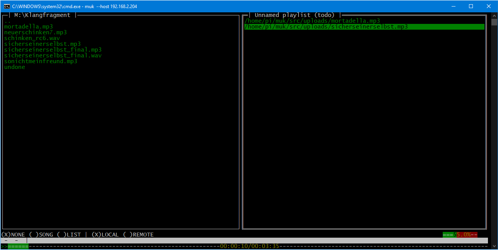

MUK
====




Prototype (!!!) of a crossplattform terminal music and video player.
Inspired by moc and mpd.

Uses the mighty `mpv` as audio backend.

'mukke' is a german slang for music.

Warning, this is not "production grade", use the
network enabled muk/mukd in trusted networks only!

Keyboard Binding
----------------


|     Pane       |    KEY     | Action  |
| ------------- |:-------------:| -----:|
| BOTH | {TAB}  | Switch Pane Filesystem <-> Playlist |
| BOTH | {j}/{k}/{DOWN}/{UP} | DOWN/UP Selection |
| BOTH | {h}/{l}/{LEFT}/{RIGHT} | Seek backwards/forwars |
| BOTH | {ShiftH}/{ShiftL}/{LeftBracket}/{RightBracket}  | Seek backwards/forwars faster |
| BOTH | {-}/{+} | Volume DOWN/UP |
| BOTH | {ShiftJ, ShifK} | Next/Previous song |
| BOTH | {Enter} | Play/Open |
| BOTH | {m} | Mute/Unmute |
| BOTH | {p} | Pause/Resum |
| BOTH | {p} | Pause/Resum |
| BOTH | {r} | Cycle Repeat Modes |
| BOTH | {v} | Show/Hide video |
| BOTH | {t} | playlist / filesystem fullscreen |
| BOTH | {ShiftC} | Clear the playlist |
| BOTH | {i} | Open debug log / song information |
| BOTH | {,} | Local Filesystem|
| BOTH | {.} | Remote Filesystem|
| BOTH | {g}/{/}| Search |
| BOTH | {?}/{F1} | Help |
| BOTH | {ESC} | Exit out of search/help/lyrics etc. |
| BOTH | left Mouse| highlight, seek, etc. |
| BOTH | right Mouse| activate (play/add,etc) |
| BOTH | {q} | quit muk (the gui) |
| BOTH | {ShiftQ} | quit mukd (the server) if allowed |
| Filesystem | {ShiftG} | Search recursive |
| Filesystem | {:}/{Backspace} | One folder up |
| Filesystem | {a} | Add song/directory to playlist |
| Playlist | {d}/~{Del}~ | Remove a song from the playlist |
| Playlist | {o} | select the song that is played currently |
| Playlist | ~~??????~~ | Fetch lyrics |


Features
-------

- [x] Network Client/Server
  - [x] standalone gui
  - [x] standalone audio backend
  - [x] network code
    - [x] Username/Password auth
    - [ ] secure networking
      - [ ] Encryption
      - [ ] Secure login
  - [x] (gui) local filesystem
  - [x] (gui) remote filesystem -> browse server filesystem from gui
- [x] One click, up and download, music from client <-> server
- [x] Lyric fetcher (not yet intigrated)
- [x] Cross platform
  - [x] Linux
  - [x] Windows
  - [ ] ~~Macos~~ (low priority; need testers; will not provide binaries; if you like muk build it yourself; sorry)
  - [x] ssh, tmux (no mouse support), etc..
- [x] Video support when running on a window manager
- [x] mouse support (partial ATM)
- [ ] ~~music library~~ (low priority, you have a clean music folder right? ;)
- [x] custom keybindings (requires recompilation ATM)
- [ ] custom colorscheme (low priority)
- [x] Playlist support (partial, only the current playlist is saved)


Create (network) users
------------

```
auth add -u username -p password
```

Network Protocol
----------------

Muk/Mukd is network enabled
TODO document the network protocol

Download / Install
---------

TODO
- ~~install via nimble:~~
  - ~~`nimble install muk`~~
-  [~~linux~~, windows, ~~macos~~ binaries on the release page](https://github.com/enthus1ast/muk/releases)

Build from source
-----------------

TODO

- install libmpv dev
- build: ```nim c -d:release --opt:speed mukd.nim```

Changelog
--------

- 0.1.1
  - terminal title shows current song
  - server fanouts song path
- 0.1.0 (First usable version, with network)
- 0.0.1 (Prototype)

Technologie / Credits
-----------

- [x] [Nim](https://nim-lang.org/) (programming language)
- [x] [illwill](https://github.com/johnnovak/illwill) (terminal library for nim)
- [x] [illwillWidgets](https://github.com/enthus1ast/illwillWidgets) (widget library for illwill)
- [x] [mpv/libmpv](https://github.com/mpv-player/mpv) (music/video backend)
- [ ] [LyricFetcher](https://github.com/enthus1ast/lyricFetcher) (mostly done but not included)
